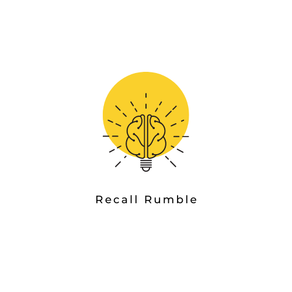
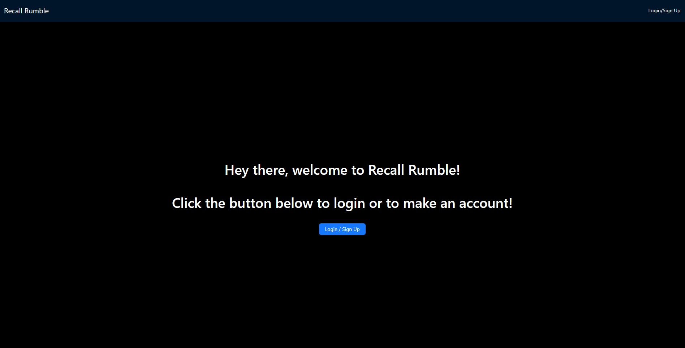
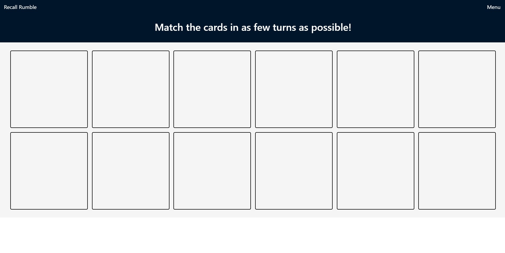

  
 

 <h1 align="center">Recall Rumble</h1>
    
    

      Get ready to Rumble
    

  
 

Table of Contents;

* [About the Project](#description) 

* [Added Features](#features)
 
* [Installation](#installation)
 
* [Usage](#usage) 

* [Contributing](#contributing)
 
* [License](#license)

* [Questions](#questions)

(<a href="#readme-top">back to top</a>)

## About The Project

(<a href="#readme-top">back to top</a>)

Recall Rumble is an interactive MERN stack single-page application that challenges players and their cognitive abilities. Users can create an account, play a memory match game and add their score to the leaderboard!

## Added Features
- Sign-up/login and make an account
- Card style memory game where you match images!
- Leaderboard to compete with other players
- User profile with user info, high score and last score
- Donation page if you feel like making a donation! (In test mode so funds do not actually deposit)

(<a href="#readme-top">back to top</a>)

## Installation

One of the key advantages of web-based applications is that they can be accessed and used without the need for installation. No installation is required so sit back, relax and enjoy our game!

(<a href="#readme-top">back to top</a>)

  

## Usage

    
   
 The deployed site can be found on
   <a href="https://recallrumble.herokuapp.com/">Heroku</a>
   

(<a href="#readme-top">back to top</a>)

## Contributing

### Tasks and Roles 
[`Domenico Barberi`](https://github.com/DomenicoBarb)
> Led the project with contributions including website framework, Stripe payment processing, Ant Design integration, route protection/authentication, and leaderboard logic
---
[`Mason Lagrange`](https://github.com/masonlagrange)
> Database, models, mutations, and queries
--- 
[`Parth Mali`](https://github.com/Parth0415)
> Javascript difficulty logic, Application styling and Brainstorming ideas
---
[`Christina Barberi`](https://github.com/Christinaecb)
> Javascript card logic, games model, game visuals with robohash
---
[`Ayad Patel`](https://github.com/AyadPatel)
> Brainstorming ideas

(<a href="#readme-top">back to top</a>)

## License
Distributed under the MIT License. See `LICENSE.txt` for more information.
  

(<a href="#readme-top">back to top</a>)

## Questions?

If you have any questions about this project, please don't hesitate to reach out to me. I'm always happy to help and provide additional information! 

[`Domenico Barberi`](https://github.com/DomenicoBarb)
> domenicoabarberi@gmail.com
---
[`Mason Lagrange`](https://github.com/masonlagrange)
> mason.lagrange@gmail.com
--- 
[`Parth Mali`](https://github.com/Parth0415)
> parthmali1597@gmail.com
---
[`Christina Barberi`](https://github.com/Christinaecb)
> christina.e.c.barberi@gmail.com
---
[`Ayad Patel`](https://github.com/AyadPatel)
> ayadpatel93@gmail.com
